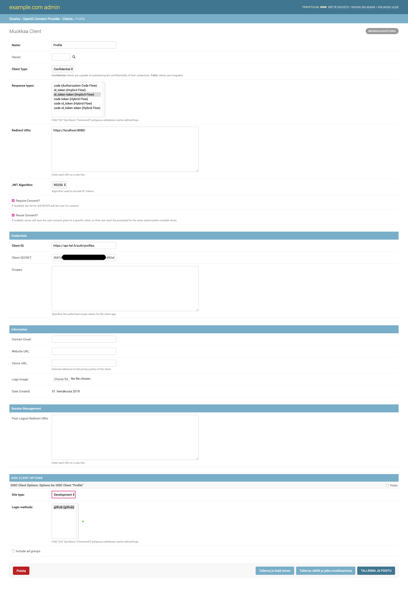
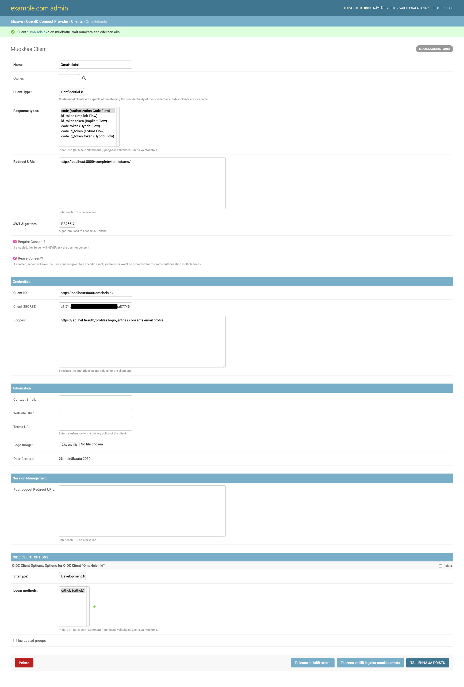
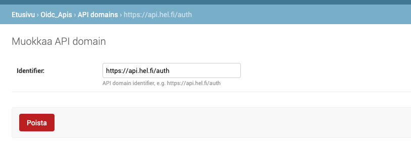
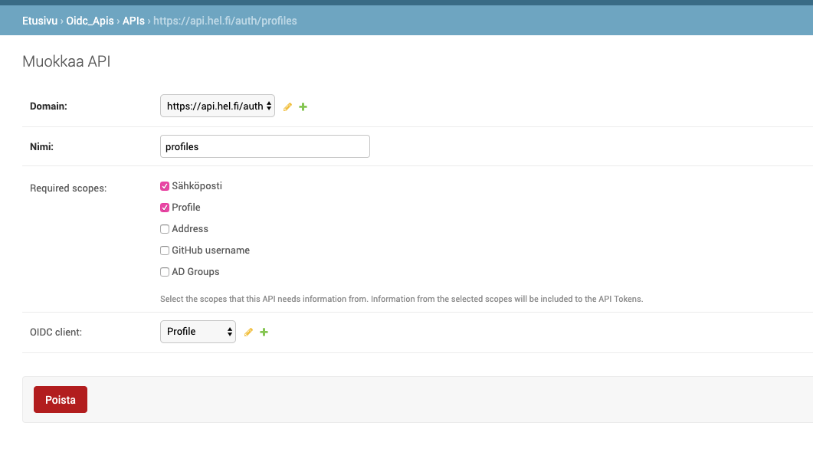
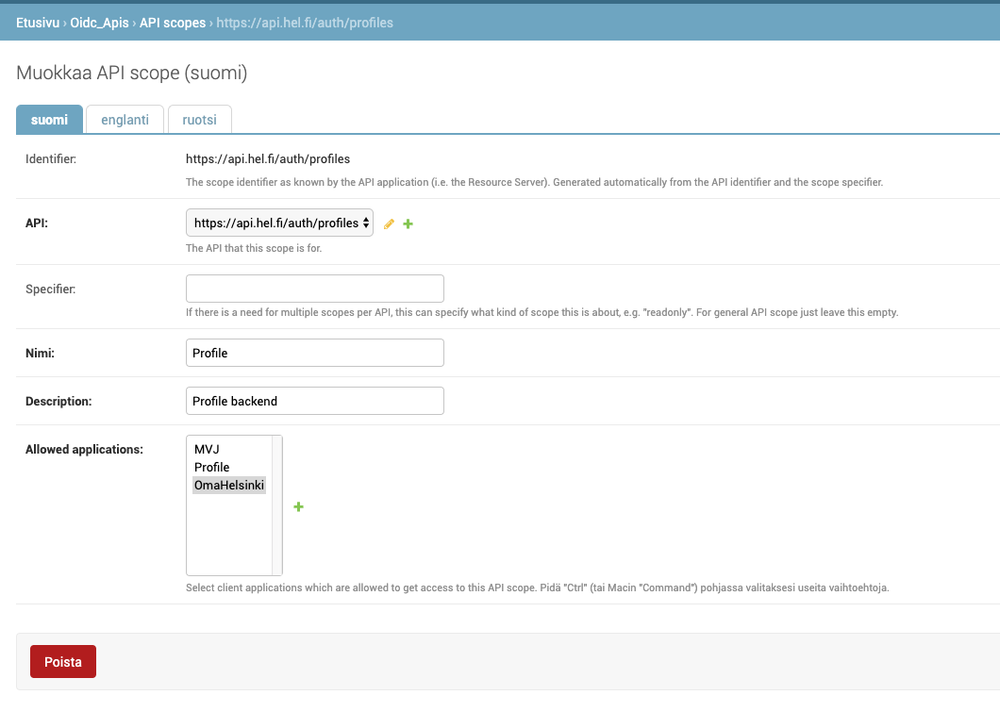

# How to configure clients, scopes and APIs for Omahelsinki

## 1. Configure an OIDC client for the profile

In tunnistamo’s admin panel go to “OpenID Connect Provider” → “Client” → “Add”:

- give it any name you want

- choose “Confidential” client type

- choose “it_token token (Implicit Flow)” response type

- give it any redirect url (they won’t actually be used)

- put `https://api.hel.fi/auth/profiles` as “Client ID” (precisely this, or you won’t be able to connect it to an API later on)

- choose your social media platform  as “Login method”

- choose some “Site type”

Once you click “save”, Django will generate “Client SECRET” for this Client. Example:



## 2. Configure an OIDC client for Omahelsinki

In tunnistamo’s admin panel go to “OpenID Connect Provider” → “Client” → “Add”:

- give it any name you want

- choose “Confidential” client type

- choose “code (Authorization Code Flow)” response type

- give it `http://localhost:<PORT>/complete/tunnistamo/` as redirect url

- put any string as “Client ID”

- put these into the “Scopes” field: `https://api.hel.fi/auth/profiles login_entries consents email profile`
(exactly these, exactly like that, without any commas)

- choose your social media platform  as “Login method”

- choose some “Site type”

Once you click “save”, Django will generate “Client SECRET” for this Client. Example:



## 3. Configure API scope for the profile backend

- in tunnistamo’s django admin panel go to “OIDC APIS” → “API domains” → “Add”.
Create a domain with the following identifier: `https://api.hel.fi/auth`.

    NOTE: this is not going to be used in any links, it is just an identifier, you
    do not need any actual access to this domain.



- go to “OIDC APIS” → “APIs” → “Add”. Create an API with the following settings:

    - `https://api.hel.fi/auth` as domain

    - `profiles` as name

    - “Sähköposti / Email” and “Profile” in “Required scopes”

    - the profile client you created in the 1 step as “OIDC client”

BEWARE: there is currently a bug (probably, maybe): that even though UX suggests
“OIDC client” is an optional field, it is actually REQUIRED. AND the client’s “Client ID”
has to be equal to this API’s `domain/name` combination,
i.e. `https://api.hel.fi/auth/profiles`



- go to “OIDC APIS” → “API scopes” → “Add”. Create a scope with the following settings:

    - `https://api.hel.fi/auth/profiles` as “API”

    - give it any name you want

    - give it any description you want

    - choose your Omahelsinki client (the one you created in step 2) in the
    “Allowed applications” field

Once you click “save”, Django will generate an identifier for this scope. The settings
should eventually look like this:



## 4. Configure your local instance of profile to use local instance of Tunnistamo

Before starting the Docker containers, you have to have `.env` file in the root folder
of the project with the following variables:

```bash
API_SCOPE_PREFIX=profiles
OIDC_CLIENT_ID=https://api.hel.fi/auth/profiles
OIDC_SECRET=<your-secret>
OIDC_ENDPOINT=http://tunnistamo-backend:<your-port>/openid
```

NOTE: copy the generated secret from the OIDC client you set up in step 1.

## 5. Configure your local instance of Omahelsinki to use local instances of Tunnistamo and profile

In the root folder of the project you should have a `local_settings.py` file with
the following variables:

```python
TUNNISTAMO_BASE_URL = 'http://tunnistamo-backend:<your-tunnistamo-port>'
SOCIAL_AUTH_TUNNISTAMO_KEY = '<your-client-id>'
SOCIAL_AUTH_TUNNISTAMO_SECRET = '<your-secret>'
SOCIAL_AUTH_TUNNISTAMO_OIDC_ENDPOINT = TUNNISTAMO_BASE_URL + '/openid'
PROFILE_API_URL = 'http://localhost:<your-profile-port>/v1'
```

NOTE: copy the “Client ID” and the generated secret from the OIDC client you set up
in step 2.

`PROFILE_API_URL` can use `localhost` because this variable will be used by the JS
code directly in the browser, so it can access it through this address.

Now, you can start all your docker containers and you should be able to log in into
the Omahelsinki profile.
