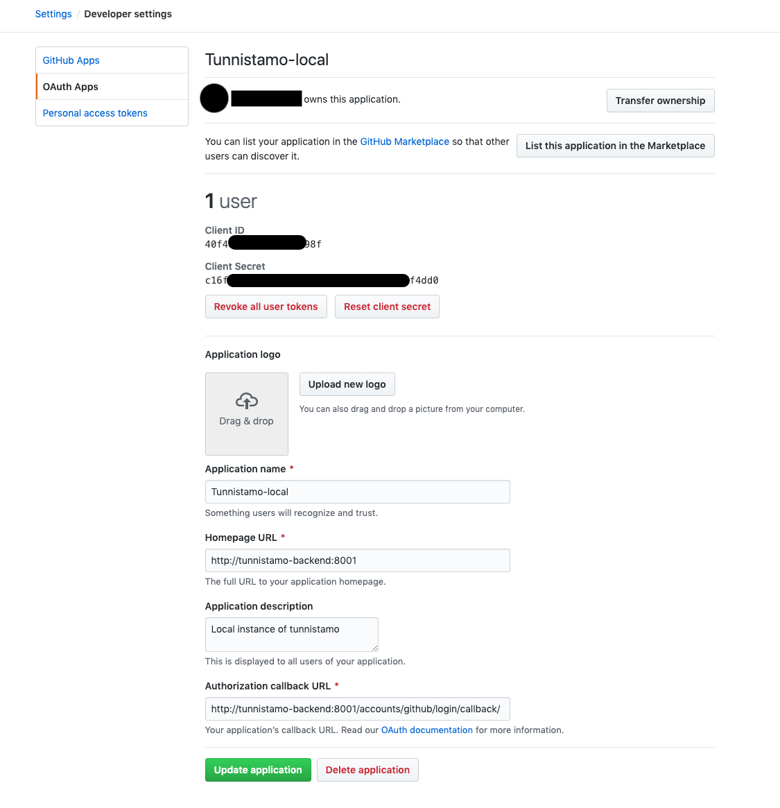

# How to connect Tunnistamo, Profile and Omahelsinki running on Docker

If you are using Docker to run each of the services above, you need to make sure, that
they can access each other from within their containers. In order to do that, you need
to make sure, that they are running on the same Docker network:

1. Make sure, that each project runs on different ports to avoid port conflicts, for
example omahelsinki on 80, profile on 8000 and tunnistamo on 8080.

2. Add network definition to tunnistamo's `docker-compose.yml`:

    ```yaml
    version: '3'
    services:
        postgres:
            ...
            networks:
                - net
            
        django:
            ...
            networks:
                - net
            
    networks:
        net:
            driver: bridge

    ```

3. Connect omahelsinki and profile to tunnistamo's network, by adding this code snippet
at the end of omahelsinki's and open-city-profile's `docker-compose.yml` files:

    ```yaml
    networks:
        default:
             external:
                 name: tunnistamo_net
    ```

    The name `tunnistamo_net` comes from the name of the folder, where your tunnistamo
    code is combined with the name of the network. Change those according to your
    setup, if needed.

4. Now you can access tunnistamo from within other docker containers with 
`http://tunnistamo-backend:<port>` url, i.e. Tunnistamo's django container's name.

5. Your tunnistamo instance needs to have at least one social media login method
configured, for example Github. As the authentication flow will be initiated by
omahelsinki using the `http://tunnistamo-backend:<port>` link, when tunnistamo will
call this social media platform it will pass this link as the origin and as the base
of the callback, so the oauth app in your social media should be configured to use
this precise link:

    

6. When the user authenticates through the social media, it will redirect them back to
the `http://tunnistamo-backend:<port>` link, so your machine should now that this is
your local tunnistamo instance: add `tunnistamo-backend` to your computer's localhost
aliases. To do this on UNIX-like systems open `/etc/hosts` and add it:

    ```bash
    127.0.0.1    localhost tunnistamo-backend
    ```